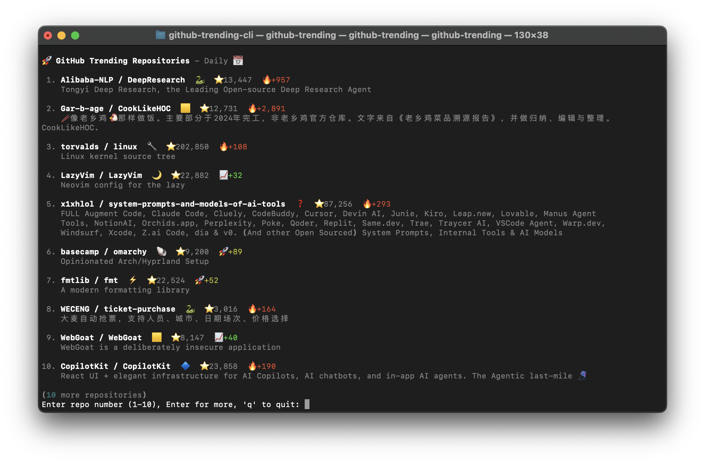

# Git Trending

We like browsing GitHub's trending page, so we built a Git extension for it.

Browse trending repositories from your terminal. View READMEs, export data, and skip the web interface.



[](https://www.python.org/downloads/)
[](https://opensource.org/licenses/MIT)

## What it does

- Works as a Git extension (`git trending`)
- Daily, weekly, and monthly trending views
- Click repositories to read their READMEs
- Export data to CSV or JSON Lines
- Terminal-based interface
- No configuration needed

## Installation

### pipx (Recommended)

```bash
# Install pipx if you don't have it
pip install --user pipx
pipx ensurepath

# Install git-trending
pipx install git+https://github.com/psalias2006/github-trending-cli.git

# Use it anywhere
git trending
```

### Development

```bash
git clone https://github.com/psalias2006/github-trending-cli.git
cd github-trending-cli
python3 -m venv venv && source venv/bin/activate
pip install -r requirements.txt && pip install -e .
```

### Docker

```bash
git clone https://github.com/psalias2006/github-trending-cli.git
cd github-trending-cli
docker build -t git-trending .
```

## Usage

```bash
git trending                 # Show today's trending repos
git trending -r weekly       # Show this week's trending repos
git trending -r monthly      # Show this month's trending repos
```

### Export

```bash
git trending -e              # Export to CSV
git trending -e -f json      # Export as JSON Lines
git trending -e -r weekly    # Export weekly data
```

### Docker

```bash
docker run -it --rm git-trending
docker run -it --rm git-trending -r weekly

# Export (requires volume mount)
docker run --rm -v "$(pwd)/exported:/app/exported" git-trending -e
docker run --rm -v "$(pwd)/exported:/app/exported" git-trending -e -f json
```

## How Git Extensions Work

When you install `git-trending`, Git automatically recognizes it as an extension:

- `git trending` → runs `git-trending` 
- `git trending -r weekly` → runs `git-trending -r weekly`
- Works from any directory, like other git commands

## Export Format

Files saved to `exported/` with timestamps: `github_trending_{range}_{datetime}.{csv|jsonl}`

**CSV**: Standard format with headers  
**JSON Lines**: One JSON object per line

**Columns**: name, url, description, language, stars, stars_period, range, export_datetime

## Contributing

Fork it, make changes, send a PR.

## License

MIT